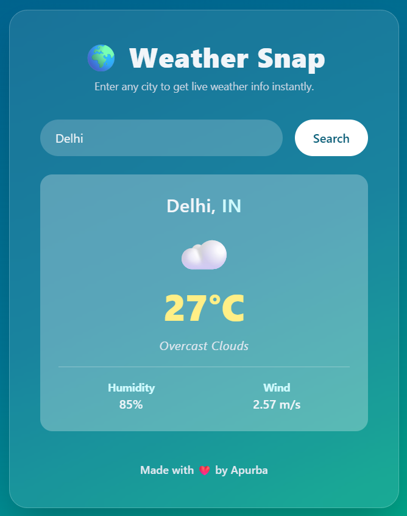

# 🌍 Weather Snap

**Weather Snap** is a sleek and modern weather app built with **React**, **Tailwind CSS**, and **Vite**. It allows you to get real-time weather updates for any city in the world using the **OpenWeatherMap API**.

 <!-- Optional: Add a screenshot if you like -->

---

## ✨ Features

* 🌤️ Real-time weather data (temperature, humidity, wind)
* 🔎 Search any city in the world
* 🎨 Beautiful UI with smooth animations (Framer Motion)
* 🌈 Responsive and minimal design
* ⚡ Built with Vite for fast performance

---

## 👷 Tech Stack

* **React** – Frontend framework
* **Vite** – Lightning fast dev server & build tool
* **Tailwind CSS** – Utility-first styling
* **Framer Motion** – Animations
* **OpenWeatherMap API** – Weather data

---

## 🚀 Getting Started

### 1. Clone the Repository

```bash
git clone https://github.com/your-username/weather-snap.git
cd weather-snap
```

### 2. Install Dependencies

```bash
npm install
```

### 3. Add API Key

Create a `.env` file in the root of the project:

```env
VITE_WEATHER_API_KEY=your_openweathermap_api_key
```

Then in your code, access it using:

```js
const API_KEY = import.meta.env.VITE_WEATHER_API_KEY;
```

> *(You can skip this step if you're using the key directly in the code.)*

### 4. Run the App

```bash
npm run dev
```

Open your browser and go to `http://localhost:5173`.

---

## 📆 Build for Production

```bash
npm run build
```

To preview:

```bash
npm run preview
```

---

## 🌐 API Reference

* [OpenWeatherMap API](https://openweathermap.org/current)

---

## 📄 License

MIT © 2025 — \[Your Name]

---

## 🙌 Acknowledgements

* [Tailwind CSS](https://tailwindcss.com)
* [Vite](https://vitejs.dev)
* [Framer Motion](https://www.framer.com/motion/)
* [OpenWeatherMap](https://openweathermap.org)
